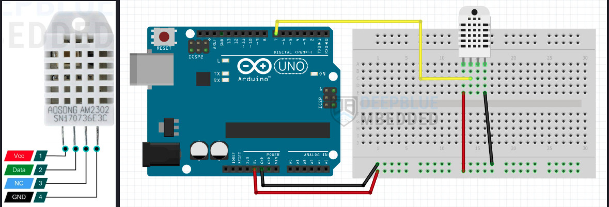

# Arduino DHT22 Temperature & Humidity Monitor

A complete real-time monitoring system for temperature and humidity data using Arduino DHT22 sensor with Python visualization and data logging.

## 🌡️ Features

### Real-Time Monitoring
- **Live plotting** with matplotlib animation showing temperature and humidity curves
- **24-hour rolling window** display with smooth interpolated curves
- **Configurable intervals** (default: 10 minutes) for data collection
- **START and NOW labels** showing initial values and current real-time readings
- **Dark theme** visualization with professional styling

### Data Management
- **Automatic logging** to CSV format (`TemHumi.log`)
- **Calibration system** with adjustable humidity and temperature offsets
- **Historical data plotting** with both interactive and non-interactive modes
- **10-minute aggregation** for cleaner long-term trend analysis

### Visualization Options
- **Real-time plots**: Live monitoring with 24-hour window
- **Historical plots**: Analyze logged data with shell script launchers
- **Dual time axes**: 6-hour intervals with daily date markers
- **Fixed Y-axis ranges**: 20-100% humidity, 10-40°C temperature
- **Smooth curves**: Spline interpolation for professional appearance

## 📋 Requirements

### Hardware
- Arduino Uno (or compatible)
- DHT22 temperature/humidity sensor
- USB cable for serial connection

### Software
- Python 3.x with packages:
  - `matplotlib`
  - `numpy`
  - `pyserial`
  - `scipy`
- Arduino IDE or VS Code with Arduino extension
- DHT sensor library for Arduino

## 🔧 Installation

1. **Clone the repository**:
   ```bash
   git clone https://github.com/antibody-br/TemHumi.git
   cd TemHumi
   ```

2. **Install Python dependencies**:
   ```bash
   pip install matplotlib numpy pyserial scipy
   ```

3. **Upload Arduino sketch**:
   - Open `TemHumi_22/TemHumi_22.ino` in Arduino IDE
   -  🔌 Wiring DHT22

      - pin1: VCC   → 5V
      - pin2: DATA  → Digital Pin 7
      - pin3: NC    → (not connected)
      - pin4: GND   → Ground


         
         


   - Upload to your Arduino board. 

4. **Configure serial port**:
   - Update `PORT` variable in `TemHum_read_serial_DHT.py`
   - to find your Arduino port (macos):
      ```bash
      Users/<username>/Documents/Arduino/bin/arduino-cli board list` 
      ```   

   - Default: `/dev/cu.usbserial-31310`
5. **Delete TemHumi.log**:
      - If you have an existing `TemHumi.log` file from previous runs, delete it to start fresh:
         ```bash
         rm TemHumi.log
         ```   


## 🚀 Usage

### Real-Time Monitoring
```bash
python TemHum_read_serial_DHT.py
```
Displays live temperature and humidity data with:
- 24-hour rolling window
- START labels showing initial values
- NOW labels showing current readings
- Automatic data logging

### Historical Data Analysis
```bash
# Interactive plot (shows on screen + saves PNG)
bash plot_logs_interactive.sh

# Non-interactive (saves PNG only)
bash plot_logs.sh
```

### Configuration Options
Edit variables in `TemHum_read_serial_DHT.py`:
```python
TIME_WINDOW = 60*60*24          # 24-hour display window
PLOT_INTERVAL_MINUTES = 10      # Data collection interval
HUMIDITY_OFFSET = -4            # Humidity calibration
TEMPERATURE_OFFSET = -0.5       # Temperature calibration
```

## 📊 Output Examples

### Real-Time Display
- Live curves showing temperature and humidity trends
- Green START labels at beginning of session
- Blue/red NOW labels showing current values
- Professional dark theme with grid

### Data Log Format
```csv
Timestamp,Humidity,Temperature
2025-10-24 09:55:49,51.8,23.8
2025-10-24 10:05:49,52.1,24.0
2025-10-24 10:15:49,52.3,24.2
```

## 📁 Project Structure

```
TemHumi/
├── TemHumi_22/
│   └── TemHumi_22.ino           # Arduino sketch
├── TemHum_read_serial_DHT.py    # Real-time monitoring
├── plot_temhumi_interactive.py  # Interactive plotting
├── plot_temhumi_noninteractive.py # Batch plotting
├── plot_logs_interactive.sh     # Shell launcher (interactive)
├── plot_logs.sh                 # Shell launcher (batch)
└── TemHumi.log                  # Data log file
```

## ⚙️ Technical Details

- **Sensor**: DHT22 (±0.5°C, ±2-5% RH accuracy)
- **Communication**: Serial 9600 baud
- **Data format**: `humidity|temperature`
- **Plot refresh**: 100ms animation interval
- **Curve smoothing**: Spline interpolation (3x density)
- **Memory management**: Automatic cleanup of old data points

## 📈 Features in Detail

### Calibration System
Adjust sensor readings with offset variables:
- `HUMIDITY_OFFSET`: Add/subtract percentage points
- `TEMPERATURE_OFFSET`: Add/subtract degrees Celsius

### Time Management
- **Rolling window**: Automatically removes data older than 24 hours
- **Flexible intervals**: Change `PLOT_INTERVAL_MINUTES` for different collection rates
- **Time formatting**: 6-hour major ticks, daily date labels

### Label System
- **START labels**: Green, positioned below curve at session start
- **NOW labels**: Blue/red, positioned above curve showing current values
- **Smart positioning**: Labels placed to avoid overlap and stay within plot bounds

## 🤝 Contributing

Contributions welcome! Please feel free to submit pull requests or open issues for:
- Additional sensor support
- Enhanced visualization features
- Performance improvements
- Documentation updates

## 📄 License

This project is open source. Feel free to use, modify, and distribute according to your needs.

## 📞 Support

For questions or issues, please open a GitHub issue or contact the project maintainer.

---

**Author**: [antibody-br](https://github.com/antibody-br)
in colaberation with 🤖: Copilot/Claude Sonnet 4

**Project**: Arduino DHT22 Temperature & Humidity Monitor  
**Version**: 1.1  
**Date**: October 2025